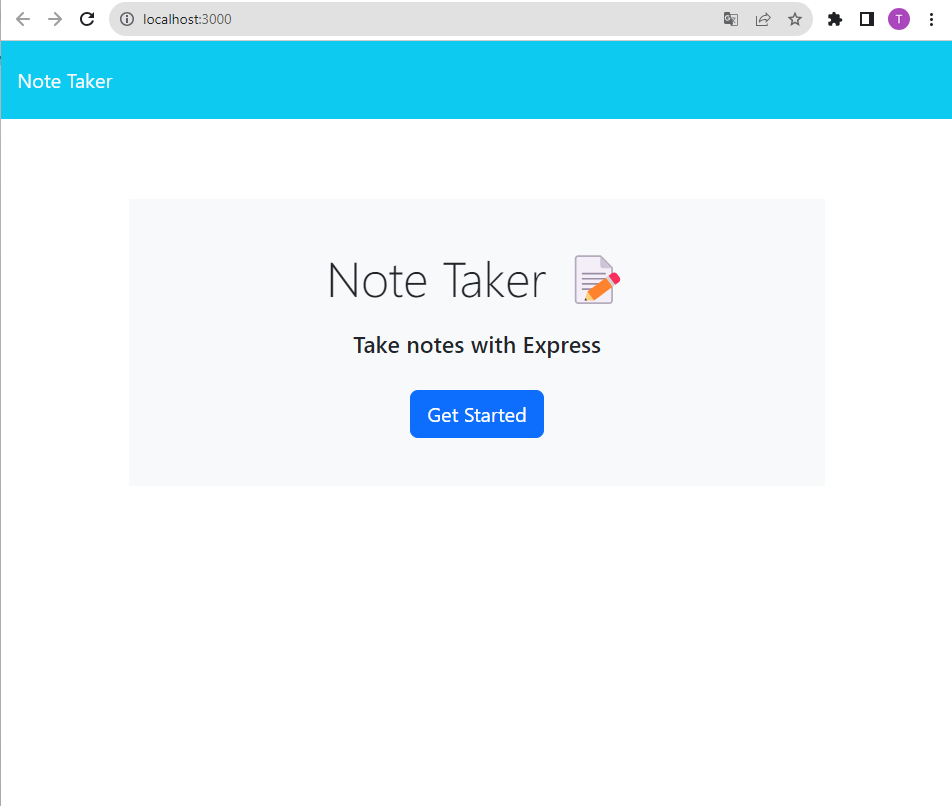

# Note Taker App

## Description

The Note Taker App is an application that allows users to write and save notes. It uses an Express.js back end and saves and retrieves note data from a JSON file.

With this app you will be able to add a title and description to your note and saved it or delete it if you dont need it anymore.


## Installation

To run the Note Taker App locally, you need to have Node.js installed on your machine. Then, follow these steps:

1. Clone this repository to your local machine.
2. Navigate to the project's root directory in your terminal.
3. Run the following command to install the required dependencies:
 ```npm install```


## Usage

To start the Note Taker App, run the following command in the project's root directory:
 ```npm start```


Then, open your web browser and go to `http://localhost:3000` to access the application.

## Deployed Application

The Note Taker App is deployed on Heroku. You can access it by clicking [here](https://your-heroku-app-url).

## Technologies Used

- Express.js
- Node.js
- HTML
- CSS
- JavaScript

## License

This project is licensed under the MIT license. Please see the `LICENSE` file for more details.

## Screenshots

Here are some screenshots of the Note Taker App:




## Contributing

Contributions are welcome! If you would like to contribute to this project, please fork the repository and submit a pull request.

## Contact

If you have any questions or want to contribute to this project, you can contact me at [thelma.rivas00@gmail.com].

Thank you for using the Note Taker App! Happy note-taking!